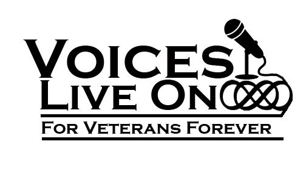

## Interviewed by Voices Live On | for Veterans

### To create his “Library of Life” for America to Listen & Learn from his Stories!

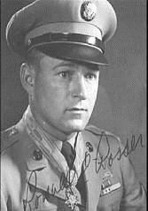

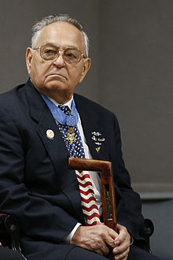

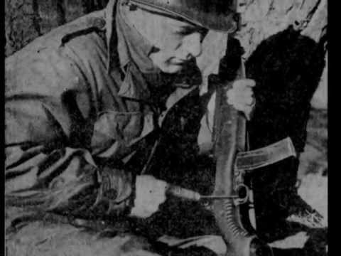

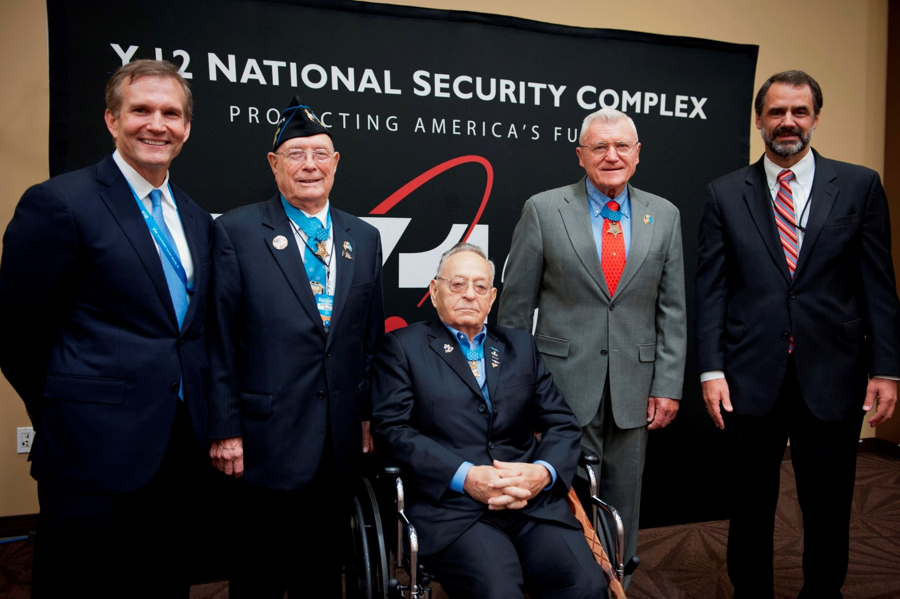

>Ronald E. Rosser with President Harry Truman
>
>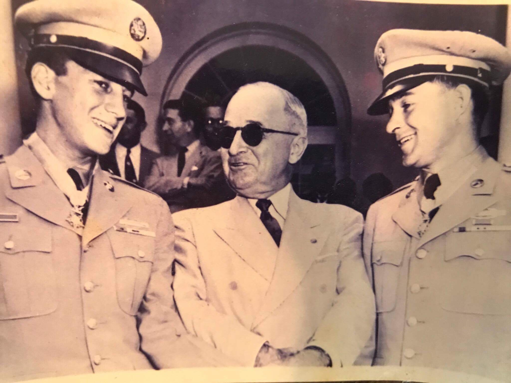  

>Ronald E. Rosser with President John F. Kennedy
>
>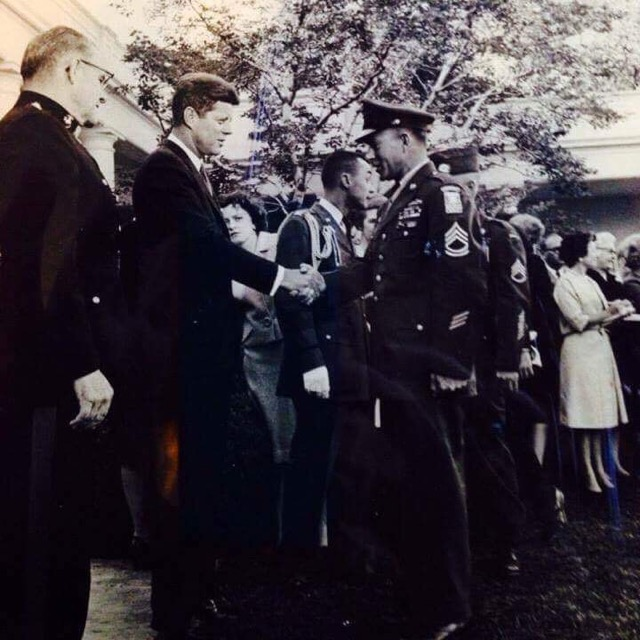

>Ronald E. Rosser with Medal of Honor
>
>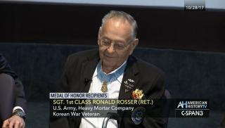

>Ronald E. Rosser with President Donald Trump
>
>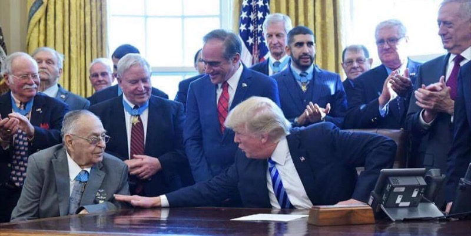

>Ronald E. Rosser with Sean J. Kurker VLO Founder/CEO/Interviewer
>
>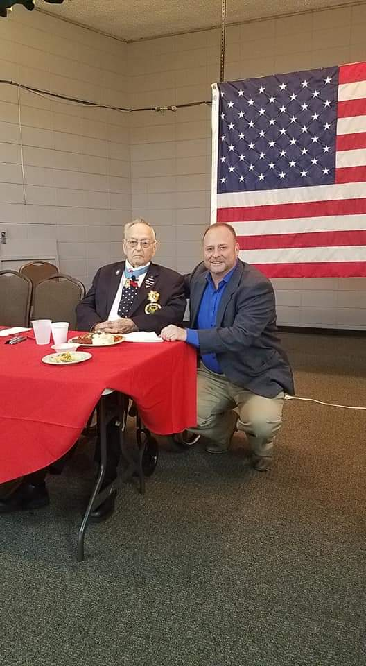

>Ronald E. Rosser with David Fraley Military Historian-Interviewer
>
>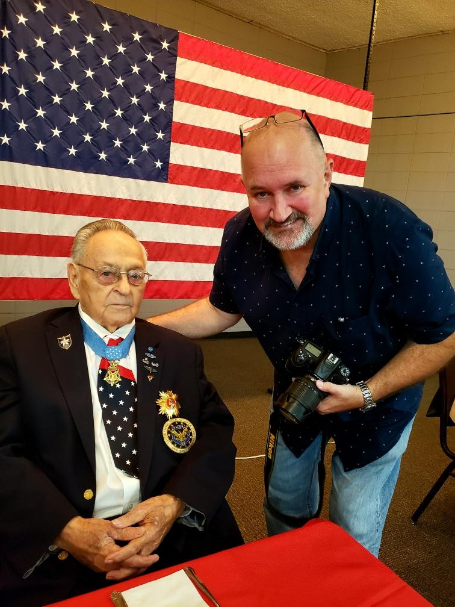

### Listen to Sergeant Ronald E Rosser speak of his Military Career, Presidents he has advised from Truman to Trump,  and each President in between. You can hear Sergeant Rosser describe charging 1000’s of the enemy and surviving many different conflicts.  Sergeant Rosser interviewed by  VoicesLiveOn.com for Veterans.

#### Interviewers: Sean J Kurker, VLO Founder/CEO & David Fraley, Military Historian

***

Born in Columbus, Ohio. Parents and 17 brothers and sisters, plus childhood survival in the woods for weeks on end when he was 12 years old.

<audio controls src="https://s3.us-east-2.amazonaws.com/voicesliveon/Ronald+Rosser+Medal+of+Honor+Korean+War+1952+Veteran+%26+American+Hero+/4+mins+22+sec+Ronald+E+Rosser+beginning+of+Life+Columbus+Oh+Parents+John+Milton+Edeth+Marie+Rosser+17+siblings+would+escape+to+the+woods+for+weeks+and+survive+grade+school+and+high+school+Crooksville+Roseville+join+army+17+See+the+World.MP3"></audio>  

***

Joined the Army at 17 began his military achievements.

<audio controls src="https://s3.us-east-2.amazonaws.com/voicesliveon/Ronald+Rosser+Medal+of+Honor+Korean+War+1952+Veteran+%26+American+Hero+/11+min+33+secs+Ronald+E+Rosser+Sergeant+Joined+US+army+age+17+Air+Borne+motivation+Fort+Cambell+101st+Airborne+82nd+Air+borne+187th+Occupation+of+Japan+Instructor+at+Jump+School+Norman+Schwarzkopf+1956+Colin+Powell+Bob+Howard+Awards.MP3"></audio>  

***

Presidential experiences & thoughts on JFK’s assassination, Ronald Reagan and advice about North Korea to President Trump

<audio controls src="https://s3.us-east-2.amazonaws.com/voicesliveon/Ronald+Rosser+Medal+of+Honor+Korean+War+1952+Veteran+%26+American+Hero+/10+min+12+sec+Ronald+E+Rosser+Memories+with+Presidents+Since+Truman-+White+House+invites+John+F+Kennedy+day+before+assination+1+or+2+shooters+question+Regan+experiences++Advice+to+Trump+about+North+Korea+cant+trust+them.MP3"></audio>

***

Korea USO Event Bob Hope, other Medal of Honor Recipients plus advice for our country’s future.

<audio controls src="https://s3.us-east-2.amazonaws.com/voicesliveon/Ronald+Rosser+Medal+of+Honor+Korean+War+1952+Veteran+%26+American+Hero+/10+44+Ronald+E+Rosser+Medal+of+Honor+Korea-+David+Fraley+interviewer+Military+USO+Show+Korea+Bob+Hope+Sergeant+Alvin+York++has+met+ALL+Medal+of+Honor+recipients+Advice+for+our+Countrys+future++Not+being+a+hero+and+the+Tiger+face+off.MP3"></audio>

***

FULL MILITARY EXPERIENCE PLAY-BY-PLAY - 40 Minute Speech at the WWII RoundTable- CHARGING THE ENEMY KOREA & SURVIVAL and many situations.

<audio controls src="https://s3.us-east-2.amazonaws.com/voicesliveon/Ronald+Rosser+Medal+of+Honor+Korean+War+1952+Veteran+%26+American+Hero+/Story+of+charging+the+enemy+and+continued+to+advance+detail+after+detail+a+incredible+story+who+has+met+every+president+since+Truman"></audio>

***

Daughter Pamela: Ronald’s APPRECIATION MESSAGE & ADVICE to her about her Military accomplishments and the future.

<audio controls src="https://s3.us-east-2.amazonaws.com/voicesliveon/Ronald+Rosser+Medal+of+Honor+Korean+War+1952+Veteran+%26+American+Hero+/3+mins+Ronald+E+Rosser+Appreciation+about+Pamela+his+daughter++Air+Borne+and+how+great+she+is+and+Advice+for+her+future.MP3"></audio>

***

Theresa Schwab speaks about her father & Rosser who both received their Medals of Honor the same day and became best friends over the years. She speaks of memories with them enjoying life together.

<audio controls src="https://s3.us-east-2.amazonaws.com/voicesliveon/Ronald+Rosser+Medal+of+Honor+Korean+War+1952+Veteran+%26+American+Hero+/Theresa+Schwab+Jerry+Crumps+daughter+whose+father+received+the+Medal+of+Honor+with+Ronald+e+Rosser+and+speks+of+their+connection+and+experiences.MP3"></audio>

***

Ken Riege speaks of only 2 DOUBLE MEDAL OF HONOR from the Korean War Ronald E. Rosser and Hershey Miyamura from New Mexico. Ken is close to Hershey and speaks of combines experiences with both Veterans.

<audio controls src="https://s3.us-east-2.amazonaws.com/voicesliveon/Ronald+Rosser+Medal+of+Honor+Korean+War+1952+Veteran+%26+American+Hero+/Ken+Riege+speaks+of+Ronald+e+Rosser+and+Hershey+Miyamura+only+other+double+Medal+of+Honor+from+Korea+and+America+speaks+of+them+both.MP3"></audio>

***

CREATE YOUR OWN LIBRARY OF LIFE STORIES & APPRECIATION MESSAGES

#### [Click Here](https://docs.google.com/forms/d/e/1FAIpQLSeIDUyD1Abc3x1e2Nh5QEmcOKF73fejWjzGb_OTZfgg1k-LAw/viewform) TO SUBMIT YOUR CONTACT INFO:

We can interview individuals, families, and multiple people to honor someone who has passed. (IN PERSON or OVER THE PHONE)

>From Wikipedia
>
>Born on October 24, 1929, in Columbus, Ohio, Rosser was the second oldest of seventeen children. He joined the Army in 1946 at age 17 shortly after World War II for a three-year term of service. After his older brother was killed in the early stages of the Korean War, he re-enlisted from Crooksville, Ohio, in 1951 as a way of getting revenge. Initially stationed in Japan, Rosser requested to be sent into combat and was then deployed to Korea with the heavy mortar company of the 38th Infantry Regiment, 2nd Infantry Division.
>
>On January 12, 1952, Rosser, by then a corporal, was acting as a forward observer with Company L's lead platoon during an assault on a heavily fortified hill near Ponggilli. When the unit came under heavy fire, Rosser went forward three times and attacked the hostile positions alone, each time returning to friendly lines to gather more ammunition before charging the hill again. Although wounded himself, he helped carry injured soldiers to safety once withdrawal became necessary. For these actions, Rosser was awarded the Medal of Honor.
>
>Rosser returned to the United States back in May 1952 and was formally presented with the Medal of Honor by President Harry Truman a month later, on June 27, 1952.
>
>In 1968, another of Rosser's brothers was killed in action, this time in the Vietnam War. Rosser requested a combat assignment in Vietnam but was rejected and subsequently retired from the Army as a master sergeant.

## Medal of Honor Citation

Rosser's official Medal of Honor citation reads:

Cpl. Rosser, distinguished himself by conspicuous gallantry above and beyond the call of duty. While assaulting heavily fortified enemy hill positions, Company L, 38th Infantry Regiment, was stopped by fierce automatic-weapons, small-arms, artillery, and mortar fire. Cpl. Rosser, a forward observer, was with the lead platoon of Company L when it came under fire from 2 directions. Cpl. Rosser turned his radio over to his assistant and, disregarding the enemy fire, charged the enemy positions armed with only carbine and a grenade. At the first bunker, he silenced its occupants with a burst from his weapon. Gaining the top of the hill, he killed 2 enemy soldiers, and then went down the trench, killing 5 more as he advanced. He then hurled his grenade into a bunker and shot 2 other soldiers as they emerged. Having exhausted his ammunition, he returned through the enemy fire to obtain more ammunition and grenades and charged the hill once more. Calling on others to follow him, he assaulted 2 more enemy bunkers. Although those who attempted to join him became casualties, Cpl. Rosser once again exhausted his ammunition, obtained a new supply, and returning to the hilltop a third time hurled grenades into the enemy positions. During this heroic action Cpl. Rosser single-handedly killed at least 13 of the enemy. After exhausting his ammunition he accompanied the withdrawing platoon, and though himself wounded, made several trips across open terrain still under enemy fire to help remove other men injured more seriously than himself. This outstanding soldier's courageous and selfless devotion to duty is worthy of emulation by all men. He has contributed magnificently to the high traditions of the military service.

#### For Questions: Email voicesliveon@gmail.com  or call 317-514-5321 for Sean J. Kurker
